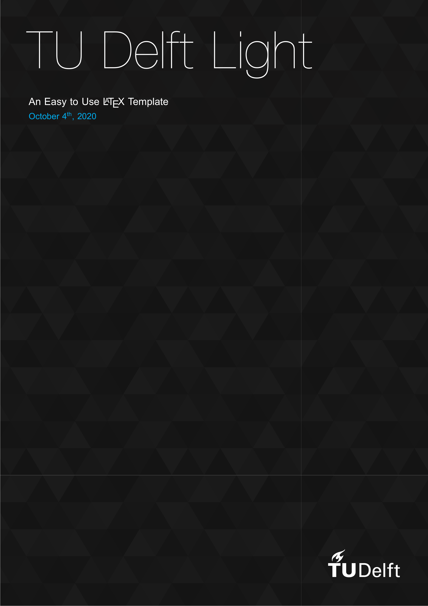
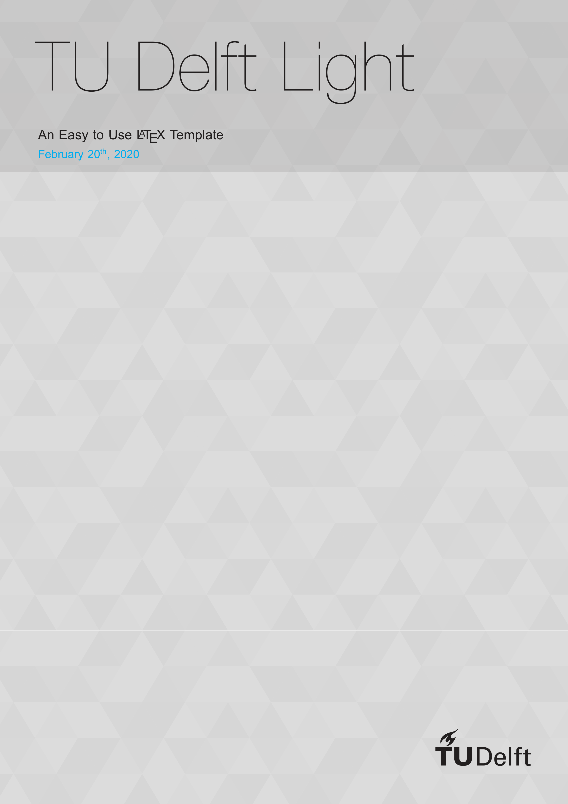
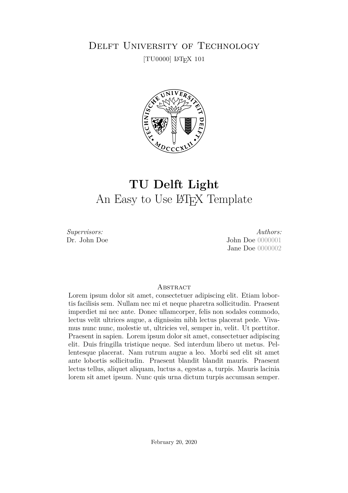
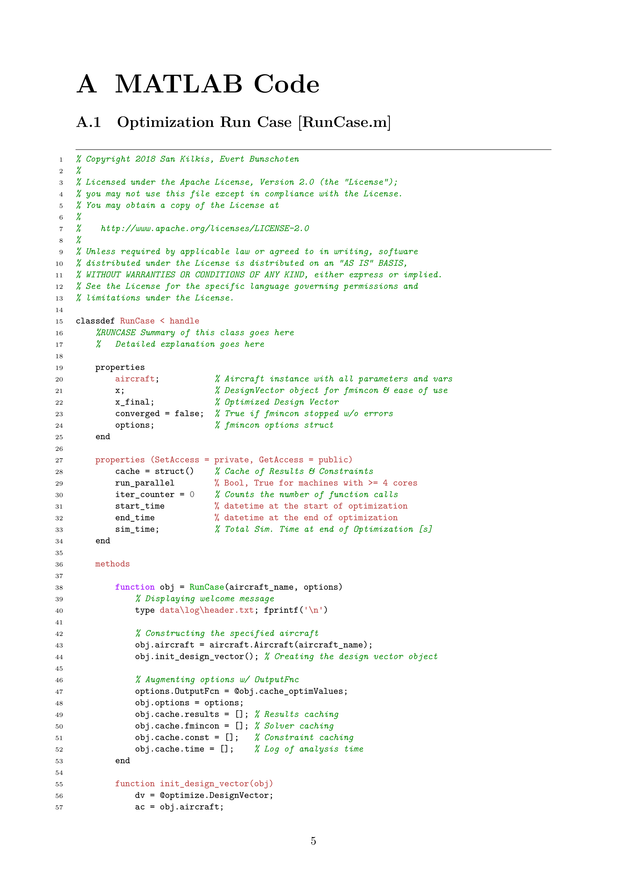

# 

A lightweight XeLaTeX Template for TU-Delft assignments and reports.

## Installation

This template can be used right away by either downloading the released files
or by embedded the template itself as a Git submodule. For the latter, a
`.gitmodules` file can be defined as explained by the instructions in the
[submodule](https://github.com/skilkis/tudelft-light-template).

## Highlights

### TikZ Cover Page

| Dark Theme | Light Theme |
| --- | --- |
|  | 

The cover pages above can be created quickly with only a single command!

```latex
\makecover[theme=light, fill opacity=0.1]
```

The `\makecover` macro is also highly customizable:

```latex
\makecover[
    theme=light,
    fill opacity=0.1,
    image scale=1,
    image angle=0,
    image xshift=0,
    image yshift=0,
    image file=tudelft-light/images/background_light.pdf
]
```

### Inner Title Page

A inner title page contains further metadata about the report/project such as
the course code, author(s), supervisor(s), and an optional short abstract.
This metadata is also automatically added to the metadata of the compiled PDF.



An included macro makes it easy to format multiple authors, student numbers,
and supervisors:

```latex
\author{John Doe | 0000001, Jane Doe | 0000002}
\supervisor{Dr. Jan Jansen}
```

### Code Listings using `minted`

To use this functionality the `Pygments` package has to be available on
the system `PATH`. Once this requirement is satisfied, adding code listings
for virtually any language is a piece of cake.


